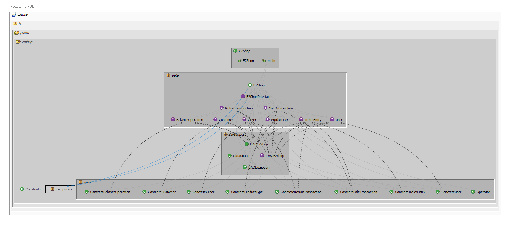
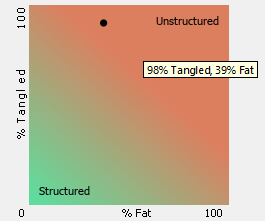
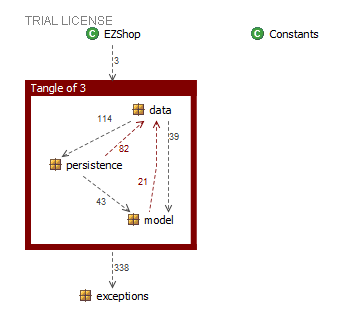

# Design assessment


```
<The goal of this document is to analyse the structure of your project, compare it with the design delivered
on April 30, discuss whether the design could be improved>
```

The design could be improved merging data and model packages. The reason is that the actual structure has a very high level of tangles (98%) due to the presence of dependent classes and methods between the two packages. The ideal behavior is having the Interfaces and Classes in the same package to reduce coupling.

# Levelized structure map

```
<Applying Structure 101 to your project, version to be delivered on june 4, produce the Levelized structure map,
with all elements explosed, all dependencies, NO tangles; and report it here as a picture>
```


# Structural over complexity chart
```
<Applying Structure 101 to your project, version to be delivered on june 4, produce the structural over complexity chart; and report it here as a picture>
```


# Size metrics

```
<Report here the metrics about the size of your project, collected using Structure 101>
```


| Metric                                    | Measure |
| ----------------------------------------- | ------- |
| Packages                                  | 7       |
| Classes (outer)                           | 44      |
| Classes (all)                             | 44      |
| NI (number of bytecode instructions)      | 9981    |
| LOC (non comment non blank lines of code) | 4292    |


# Items with XS

```
<Report here information about code tangles and fat packages>
```

| Item                                                         | Tangled | Fat  | Size | XS   |
| ------------------------------------------------------------ | ------- | ---- | ---- | ---- |
| ezshop.it.polito.ezshop                                      | 16%     | 7    | 9981 | 1606 |
| ezshop.it.polito.ezshop.data.EZShop                          |         | 137  | 3931 | 487  |
| ezshop.it.polito.ezshop.data.EZShop.addProductToSale(java.lang.Integer, java.lang.String, int):boolean |         | 19   | 204  | 42   |
| ezshop.it.polito.ezshop.data.EZShop.returnProduct(java.lang.Integer, java.lang.String, int):boolean |         | 18   | 152  | 25   |
| ezshop.it.polito.ezshop.data.EZShop.deleteProductFromSale(java.lang.Integer, java.lang.String, int):boolean |         | 17   | 179  | 21   |
| ezshop.it.polito.ezshop.data.EZShop.updatePosition(java.lang.Integer, java.lang.String):boolean |         | 16   | 156  | 9    |


# Package level tangles

```
<Report screen captures of the package-level tangles by opening the items in the "composition perspective" 
(double click on the tangle from the Views->Complexity page)>
```



# Summary analysis
```
<Discuss here main differences of the current structure of your project vs the design delivered on April 30>
<Discuss if the current structure shows weaknesses that should be fixed>
```

Referring to the class diagram the main differences between the current and the original one are the removal of some classes (Credit, Debit, Position, Admin, ShopManager, Card, AccountBook) and of the inheritance among some classes (Return Transaction, Sale Transaction). 

The weaknesses shown by the current design are a very high level of tangles (98%) due to the presence of dependent classes and methods between the model and data packages and the factor of 39% of fat.    
