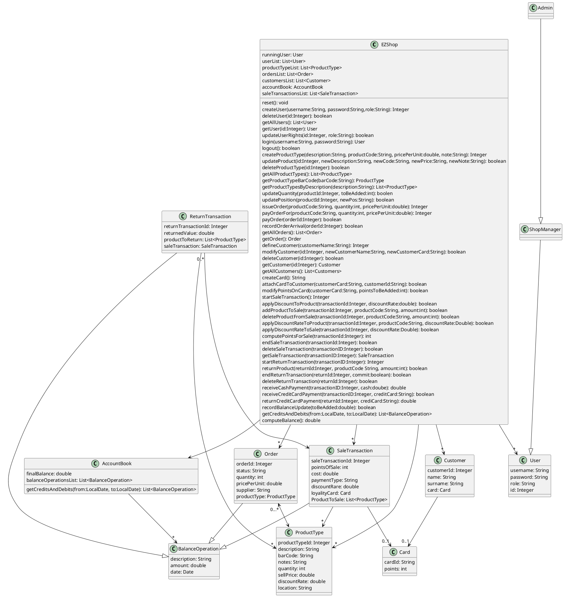

# Design Document 

Authors: Marco Sapio, Marta Caggiano, Emma Marrocu, Francesco Rabezzano

Date: April 2021

Version: 1.0.0

# Contents

- [High level design](#package-diagram)
- [Low level design](#class-diagram)
- [Verification traceability matrix](#verification-traceability-matrix)
- [Verification sequence diagrams](#verification-sequence-diagrams)

# High level design 

# Low level design

# Verification traceability matrix

# Verification sequence diagrams 

#### Scenario 1.1

#### Scenario 2.2

#### Scenario 3.1

#### Scenario 3.3

#### Scenario 6.1 + 7.1

#### Scenario 6.1 + 7.4

#### Scenario 8.1

#### Scenario 9.1

