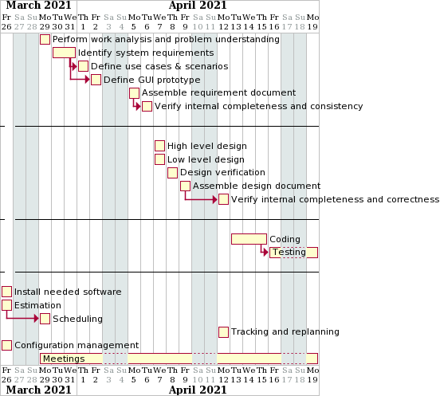

# Project Estimation  
Authors: Marco Sapio, Francesco Rabezzano, Marta Caggiano, Emma Marrocu
Date: April 2021
Version: 1.0.1

# Contents
- [Estimate by product decomposition]
- [Estimate by activity decomposition ]

# Estimate by product decomposition
### 
|             | Estimate                        |             
| ----------- | ------------------------------- |  
| NC =  Estimated number of classes to be developed   |        30                     |             
|  A = Estimated average size per class, in LOC       |          150 LOC                  | 
| S = Estimated size of project, in LOC (= NC * A) |4500 |  
| E = Estimated effort, in person hours (here use productivity 10 LOC per person hour)  | 450 ph                                      |   
| C = Estimated cost, in euro (here use 1 person hour cost = 30 euro) | 13500 (personnel) Negligible costs for hardware.| 
| Estimated calendar time, in calendar weeks (Assume team of 4 people, 8 hours per day, 5 days per week ) |  2.8 calendar week|               
# Estimate by activity decomposition
### 
|         Activity name    | Estimated effort (person hours)   |             
| ----------- | ------------------------------- | 
| | |
|Requirements| |	
|Perform work analysis and problem understanding|	8 ph|
|Identify system requirements| 	40 ph|
|Define use cases & scenarios|	35 ph|
|Define GUI prototype|	24 ph|
|Documentation (Assemble requirement document)	| 18 ph|
|Verification&validation (verify internal completeness and consistency)|	8 ph|
|Design|	
|High level design|	8 ph|
|Low level design (class diagram)|	18 ph|
|Verification (traceability matrix and sequence diagrams)|	16 ph|
|Documentation (Assemble design document)|	15 ph|
|Verification&validation (verify design internal completeness and correctness)|	8 ph|
|Coding|	100 ph|
|Testing	|60 ph |
|Meetings|	40|
|Install needed software|	2 ph|
|Project management| 	
|Scheduling	|8 ph|
|Tracking&replanning|	3 ph|
|Configuration management | 3	

####  Gantt chart

