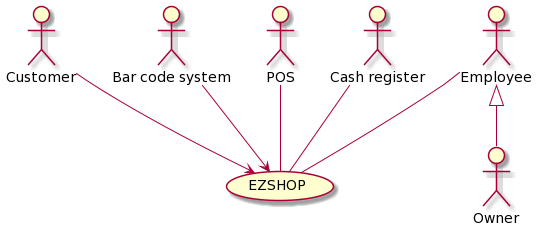
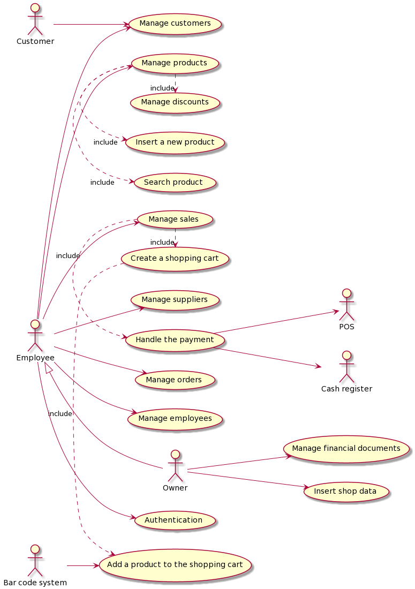
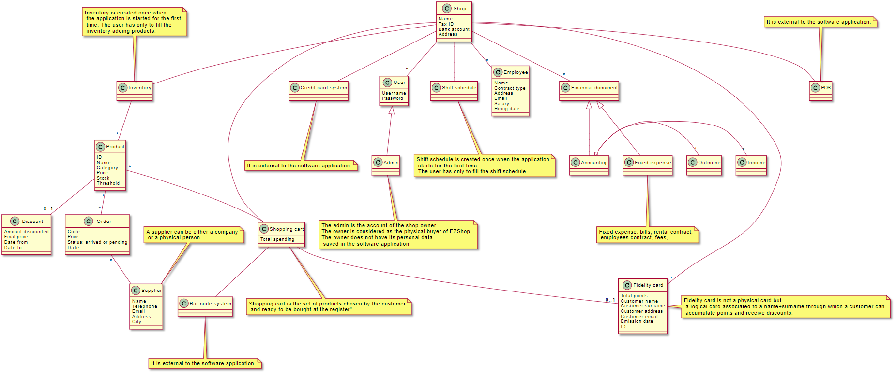
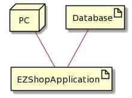

Authors: Marco Sapio, Marta Caggiano, Emma Marrocu, Francesco Rabezzano

Date: April 2021

Version: 1.0.0

# Contents

- [Essential description](#essential-description)
- [Stakeholders](#stakeholders)
- [Context Diagram and interfaces](#context-diagram-and-interfaces)
	+ [Context Diagram](#context-diagram)
	+ [Interfaces](#interfaces) 
	
- [Stories and personas](#stories-and-personas)
- [Functional and non functional requirements](#functional-and-non-functional-requirements)
	+ [Functional Requirements](#functional-requirements)
	+ [Non functional requirements](#non-functional-requirements)
- [Use case diagram and use cases](#use-case-diagram-and-use-cases)
	+ [Use case diagram](#use-case-diagram)
	+ [Use cases](#use-cases)
    	+ [Relevant scenarios](#relevant-scenarios)
- [Glossary](#glossary)
- [System design](#system-design)
- [Deployment diagram](#deployment-diagram)

# Essential Description

Small shops require a simple application to support the owner or manager. A small shop (ex a food shop) occupies 50-200 square meters, sells 500-2000 different item types, has one or a few cash registers 
EZShop is a software application to:
* manage sales
* manage inventory
* manage customers
* support accounting

# Stakeholders

| Stakeholder name  | Description | 
| ----------------- |:-----------:|
|   1.	EZShop’s Company | The company which develops the application |
|   2.	Shop's Owner | The person that buy the software|
|   3.	Shop’s Customer | A general customer of a shop|
|   4.	Shop’s Employee | A general employee of a shop|
|   5.	Bar Code system | The system responsable to read the bar code |
|   6. POS system | The system responsable to manage the credit cards transactions |
|   7. Cash register system | The system which supports the sales making receipts and tracking incomes |
|   8. Product's Supplier | The person or the company that supplies one or more products |
 
 
# Context Diagram and interfaces

## Context Diagram

## Interfaces

| Actor | Logical Interface | Physical Interface  |
| ------------- |:-------------:| -----:|
| Employee, Owner     | GUI | Screen, Keyboard |
| POS| POS API | Wireless connection |
| Cash register | Cash register API | Wired connection |
| POS |Bar code system API | Wired connection |
| Customers | Fidelity card | NULL  |

# Stories and personas

The following personas and stories are meant to cover different profiles of the Owner, Employee and Customer actors

Marta is 40, she’s the owner of a stationery shop. She managed her shop all by herself for a long time but now she wants to settle down and would like to have more free time. For this reason she would like to computerize many of her tasks like replacing the inventory written on notebooks every year with a digital one constantly updated. She would like to have all the informations related to expenses, incomes, employees etc. in a single place so that she no longer has to look into lots of folders everytime.

Emma is 22 and she is a student at the “Politecnico di Torino”. Since she studies a lot she buys a lot of stationery and she is a regular customer at Marta’s shop, which is close to her house. In particular she buys a lot of highlighters, really a lot, and for this reason she would like the shop to remember her in order to get some sort of discount sometimes.

Marco is 30 and works as employee in a minimarket. Everytime he sells something he has to write by hand in a notebook the information about the sale. Especially in the morning, when the shop is full of people, Marco forgets to write down some sales, moreover he spends time to write everything by hand so some customers get annoyed by the wait and leave the shop without buying anything. It would be much easier if the sales information were recorded automatically somewhere!

Francesco is 38 and he has been working in the family jewelry since he left school. Now his parents are quite old and he’s going to inherit the shop. The first thing he would like to change is the management of the employees, at the moment indeed to keep track of who is hired and when it has to work is a mess. The big blackboard his parents were used to use is no longer so efficient from Francesco’s point of view…

# Functional and non functional requirements

## Functional Requirements

| ID        | Description  |
| ------------- |:-------------:| 
| FR1 | Insert shop's data |
| FR1.1 | Insert tax ID |
| FR1.2 | Insert shop’s name |
| FR1.3 | Insert shop’s address | 
| FR1.4 | Insert a bank account |
| FR1.5 | Modify Shop’s data|
| FR2 | Manage products| 
| FR2.1 | Create an inventory |
| FR2.2 | Insert a new product |
| FR2.3 | Remove a product from the inventory|
| FR2.4 | Modify the price of a product | 
| FR2.5 | Show the inventory | 
| FR2.6 | Filter products | 
| FR2.7 | Search for a product |
| FR2.8 | Show the stock status of the products|
| FR2.9 | Update product availability |
| FR3 | Manage Suppliers |
| FR3.1 | Insert a new Supplier |
| FR3.2 | Modify Supplier’s data |
| FR3.3 | Show all the Suppliers |
| FR3.4 | Search for a Supplier |
| FR4 | Manage the orders |
| FR4.1 | Insert a new order |
| FR4.2 | Show all the previous orders |
| FR4.3 | Repeat a preavious order |
| FR4.4 | Update an order’s state |
| FR5 | Manage discounts |
| FR5.1 | Make products in discount |
| FR5.2 | Apply the discount |
| FR5.3 | Remove a discount |
| FR5.4 | Show all the discounted products |
| FR6 | Authentication |
| FR6.1 | Log in |
| FR6.2 | Log out |
| FR6.3 | Modify account |
| FR6.4 | Create new account |
| FR6.5 | Remove account |
| FR7 | Manage financial documents |
| FR7.1  | Show the accounting |
| FR7.2 | Filter the accounting |
| FR7.3 | Track the fixed expenses |
| FR7.3.1 |  Insert a fixed expenses |
| FR7.3.2 |  Delete a fixed expenses |
| FR7.3.3 |  Modify a fixed expenses |
| FR7.3.4 |  Change the status of the payment for an expense |
| FR7.3.5 |  Filter fixed expenses |
| FR8 | Manage sales |
| FR8.1 | Create a shopping cart |
| FR8.1.1 | Add product to the shopping cart |
| FR8.1.2 | Remove product from the shopping cart |
| FR8.1.3 | Bind shopping cart to a fidelity card |
| FR8.2 | Handle a payment |
| FR8.2.1 | Manage the payment with POS |
| FR8.2.2 | Manage the payment with cash |
| FR8.3 | Add sale to the accounting |
| FR8.4 | Rollback to a payment |
| FR8.5 | Create an invoice  |
| FR9 | Manage Employees |
| FR9.1 | Create shift schedule |
| FR9.2 | Add an Employee |
| FR9.3 | Show Employee |
| FR9.4 | Remove an Employee |
| FR9.5 | Modify an Employee |
| FR9.6 | Update shift schedule |
| FR10 | Manage Customers | 
| FR10.1 | Create fidelity card| 
| FR10.2 | Add points to the fidelity card | 
| FR10.3 | Search for a fidelity card |
| FR10.4 | Delete fidelity card |
| FR10.5 | Convert points into discounts |

## Non Functional Requirements

| ID        | Type (efficiency, reliability, ..)           | Description  | Refers to |
| ------------- |:-------------:| :-----:| -----:|
| NFR1 | Security | Keep in safe the sensitive data | FR7 |
| NFR2 | Usability | No training needed from the User to use the application | All FR |
| NFR3 | Efficiency | Speed of response (no more than 0,5 seconds) | All FR |
| NFR4 | Reliability |  No more than 2000 item types to manage, not less than 500 | FR2 |
| NFR5 | Reliability | Only 1 cash register | FR8 | 

# Use case diagram and use cases

## Use case diagram

### Use case 1, UC1 - Modify shop's data
| Actors Involved        |  Owner |
| ------------- |:-------------:| 
|  Precondition     | Log in as admin (User has a valid account); shop’s data (Tax Id, Shop name, Address, Bank account) already set up |  
|  Post condition     |All shop’s data selected are up to date; home view displayed to the admin |
|  Nominal Scenario     | Admin chooses the data shop fields to update and modifies them |

##### Scenario 1.1 (Nominal case)
| Scenario |  Modify shop’s data |
| ------------- |:-------------:| 
|  Precondition     | Log in as admin (User has a valid account); shop’s data (Tax Id, Shop name, Address, Bank account) already set up |  
|  Post condition  | All shop’s data selected are up to date; home view displayed to the admin
| Step#        | Description  |
| 1	| Owner presses the button “Modify Account”
| 2 | Owner presses the button “Modify shop’s data”
| 3 | Owner selects the field to change (Shop name, Address, Bank account)
| 4 | Owner changes the previous value typing the new one
| 5	| Owner selects it’s sure of the modifications
| 6 | Owner presses “confirm”
| 7 | Data are successfully uploaded

### Use case 2, UC2 - Insert a new product
| Actors involved |	Employee, Owner |
| ------------- |:-------------:| 
| Precondition |	Log in as owner or employee (User has a valid account) |
| Postcondition |	
| Nominal scenario | User adds a new product into the  inventory and its own Product ID, Name, Category, Sale Price, Stock, Supplier, Description, Threshold |
| Variants | User tries to add a new product but it already exists|

##### Scenario 2.1 (Nominal case)
|Scenario|	New product is added to the inventory
| ------------- |:-------------:|
|Precondition|	Log in as owner or employee; Inventory is empty or filled by some products; The introducing products are not already in the inventory
|Postcondition|	The inventory contains the new product with its own Product ID, Name, Category, Sale Price, Stock, Supplier, Description, Threshold; New product details displayed to the user |
|Step| 	Description |
|1|	User presses the button “Inventory” |
|2|	User presses the button “Add a new product” |
|3|	User writes the Product ID, Name, Category, Sale Price, Stock, Supplier, Description, Threshold of the product to add |
|4|	User presses confirm |
|5|	The new product data are successfully uploaded to the inventory |

##### Scenario 2.2 (Exception case)
|Scenario |	New product is added to the inventory but already exist |
| ------------- |:-------------:|
| Precondition | Log in as owner or employee; Inventory is empty or filled by some products; The introducing product is already in the inventory
| Postcondition | The new product is not added to the inventory; Inventory view displayed to the user
| Step | 	Description
| 1 |	User presses the button “Inventory”
| 2 |	User presses the button “Add a new product”
| 3 |	User writes the Product ID, Name, Category, Sale, Price, Stock, Supplier, Description, Threshold of the product to add
| 4 |	User presses confirm
| 5 | A warning message shows that the product trying to add is already in the inventory

### Use case 3, UC3 - Search for a product
| Actors Involved| Employee, Owner |
| ------------- |:-------------:| 
| Precondition	| Log in as admin or employee (User has a valid account)
|Postcondition	| Displayed product grid is updated (may be empty) |
|Nominal scenario| 	User search for a product |

##### Scenario 3.1 (Nominal Case)
| Scenario |  User searches for a product in the inventory |
| ------------- |:-------------:| 
| Precondition | Log in as admin or employee (User has a valid account)
| Postcondition	| Displayed product grid is updated (may be empty) |
| Step | 	Description|
|1| 	User presses the button “Inventory”
|2|	User types productID or product name in the search bar 
|4|	The grid of products matching the productID/name searched is displayed (eventually empty if no such product exists)

### Use case 4, UC4 - Filter products
| Actors Involved |  Owner, Employee |
| ------------- |:-------------:| 
| Precondition |	Log in as admin or employee (User has a valid account); Inventory is filled by one or more products; Each product has its own price and category 
|Postcondition |	Displayed product grid is updated (may be empty) |
| Nominal scenario |	User search for products matching a certain filter  | 

##### Scenario 4.1 (Nominal case)
| Scenario |  Filter products by category, price range and/or “discounted” |
| ------------- |:-------------:| 
| Precondition |	Log in as admin or employee (User has a valid account); Inventory is filled by one or more products; Each product has its own price and category |
| Postcondition |	Displayed product grid is updated (may be empty) |
| Step | 	Description |
|1|	User presses the button “Inventory”|
|2|	User presses the button “Filters”|
|3|	User selects the filters to apply |
|4|	Grid of products (could be empty) is shown|

### Use case 5, UC5 - Insert new supplier
| Actors Involved |  Owner |
| ------------- |:-------------:| 
|Precondition|	Log in as admin (User has a valid account)|
|Postcondition	|
|Nominal scenario|	Owner adds a new supplier|
|Variants|	Add an already existing supplier to the list of suppliers; Add a supplier to the list with missing data|

##### Scenario 5.1 (Nominal case)
| Scenario| Add a new supplier to the list of suppliers|
| ------------- |:-------------:| 
|Precondition|	Log in as admin (User has a valid account)|
|Postcondition|	Supplier list is up to date; Suppliers grid is displayed to the admin |
|Step 	|Description|
|1|	Owner presses the button “Orders&Suppliers”
|2|	Owner presses the button “Suppliers”
|3|	Owner presses the button “Add new supplier”
|4|	Owner writes all data about the suppliers to add (Full name, telephone, email, city, address)|
|5	|Owner presses the button “confirm”|
|6	|New Supplier’s data are uploaded|

##### Scenario 5.2 (Exception case)
| Scenario| Add an already existing supplier to the list of suppliers|
| ------------- |:-------------:| 
|Precondition|	Log in as admin (User has a valid account); Supplier to add already exists in the list|
|Postcondition|	The new Supplier is not added to the list; Suppliers grid is displayed to the admin|
|Step 	|Description|
|1|	Owner presses the button “Orders&Suppliers”|
|2|	Owner presses the button “Suppliers”|
|3|	Owner presses the button “Add new supplier”|
|4|	Owner writes all data about the supplier to add (Full name, telephone, email, city, address); Owner presses the button “confirm”|
|5|	An error message shows that the supplier already exists in the list |

##### Scenario 5.3 (Exception case)
| Scenario| Add a supplier to the list with missing data|
| ------------- |:-------------:| 
|Precondition|	Log in as admin (User has a valid account)
|Postcondition|	The new Supplier is not added to the list; “Add new Supplier” view (still) displayed to the admin (it can continue inserting the missing data)| 
|Step| Description|
|1| Owner presses the button "Orders&Suppliers"|
|2|	Owner presses the button “Suppliers”|
|3|	Owner presses the button “Add new supplier”|
|4|	User writes only some of the data in the relative fields|
|5|	Owner presses the button “confirm”|
|6|	An error message shows that there are some missing data|

### Use case 6, UC6 - Update order state
| Actors Involved |  Owner, Employee |
| ------------- |:-------------:| 
|Precondition|	Order has been delivered to the shop; Log in as admin or employee (User has a valid account); The order is already in the list of orders|
|Postcondition|	The product availability in the inventory is up to date; Orders arrived are correctly marked; Orders grid is displayed to the user|
|Nominal scenario|	User changes the product state from delivering to arrived |

##### Scenario 6.1 (Nominal Case)
| Scenario|  User changes the product state from delivering to arrived |
| ------------- |:-------------:| 
| Precondition |	Order has been delivered to the shop; Log in as admin or employee (User has a valid account); The order is already in the list of orders|
|Postcondition| The product availability in the inventory is up to date; Orders arrived are correctly marked; Orders grid is displayed to the user|
|Step | Description|
|1|	User presses the button “Orders&Suppliers”|
|2|	User chooses the right order and changes its state from pending to arrived|
|3|	The system searches for the product in the inventory and updates the quantity (FR2.9)|

### Use case 7, UC7 - Show the stock status of the products
| Actors Involved |  Owner, Employee |
| ------------- |:-------------:| 
|Precondition|	Log in as admin or employee (User has a valid account); Each product has threshold set in inventory; Inventory just modified (after sale, order delivered or new product insertion) |
|Postcondition|	Color of all product entries in the inventory coherent with product availability |
|Nominal scenario|	The system compares thresholds and changes color of products entry

##### Scenario 7.1 (Nominal case)
| Scenario |  Product availability reaches a set threshold, the system changes its entry color in the inventory |
| ------------- |:-------------:| 
|Precondition|	Log in as admin or employee (User has a valid account); Each product has threshold set in inventory; Inventory just modified (after sale, order delivered or new product insertion)|
|Postcondition|	Color of all product entries in the inventory coherent with product availability|
|Step |	Description|
|1|	The system compares product availability to threshold
|2|	The system changes the color of the product entry in the inventory (accordingly)|
|3|	… The system repeats step 1-2 for all products (i.e., the products that have been modified in the action that triggered the use case: sale, order or product insertion)|

### Use case 8, UC8 - Make product in discount
| Actors Involved |  Owner, Employee |
| ------------- |:-------------:| 
|Precondition|	Log in as admin or employee  (User has a valid account); Product to be discounted is already in the inventory|
|Postcondition	|
|Nominal scenario|	User sets a discount for a product
|Variants|	Product availability is not enough according to the quantity to be discounted|

##### Scenario 8.1 (Nominal Case)
| Scenario |  User sets a discount for a product |
| ------------- |:-------------:| 
|Precondition|	Product to be discounted is already in the inventory; Product availability (not in discount) is equal or higher than quantity of product to be discounted|
|Postcondition|	Discount information in the inventory is up to date; Product detail view is displayed to the user|
|Step |	Description|
|1|	User presses the button “Inventory”
|2|	User clicks on the productID of the product it wants to discount|
|3|	User presses the button “Manage discount”|
|4|	User inserts the final price, the starting and end date and the amount of items to discount|
|5 |	User presses the button “confirm”|
|6|	Information about the discount are uploaded |

##### Scenario 8.2 (Exception Case)
| Scenario |  User tries to set a discount for a product but the quantity is not enough |
| ------------- |:-------------:| 
|Precondition|	Product to be discounted is already in the inventory|
|Postcondition|	The view “product detail” is (still) shown to the user; The discount has not been applied to the product |
|Step |	Description|
|1|	User presses the button “Inventory”|
|2|	User clicks on the productID of the product it wants to discount|
|3|	User presses the button “Manage discount”|
|4|	User inserts the final price, the starting and end date and the amount of items to discount|
|5| 	User presses the button “confirm”|
|7|	The system sees that the quantity of the product in stock is lower than the amount to discount|
|8| 	A warning message “Invalid quantity of product” is shown  |

### Use case 9, UC9 - Log in 
| Actors Involved |  Owner, Employee |
| ------------- |:-------------:| 
|Precondition|	Any user isn’t already logged in (the last person who used the system has logged out or the application has just been launched) |
| Postcondition |	
|Nominal scenario | The user logs in into its account
|Variants |The user tries to log in but the authentication fails because the password is wrong; Account  doesn’t exist

##### Scenario 9.1 (Nominal case)
| Scenario |  User logs in into its account  |
| ------------- |:-------------:| 
| Precondition |Account exists; Any user isn’t already logged in (the last person who used the system has logged out or the application has just been launched)  |
|Postcondition|	User (=owner or employee) is logged in; The correct home view is displayed to the user| 
|Step| 	Description|
|1|	User inserts username and password|
|2|	User presses the button “Confirm”|
|3|	The software verifies that the credentials are correct|
|4|	The user is admitted in its account|

##### Scenario 9.2 (Exception case)
| Scenario |  User tries to log in but fails because the password is wrong  |
| ------------- |:-------------:| 
| Precondition |Account exists; Any user isn’t already logged in (the last person who used the system has logged out or the application has just been launched)  |
|Postcondition|	The login view is (still) shown to the user; The login failed |
|Step |	Description|
|1|	User inserts username and password|
|2|	User presses the button “Confirm”|
|3|	The software finds an account with same username but password wrong|
|4|	Error message is shown “Invalid credentials”|

##### Scenario 9.3 (Exception case)
| Scenario |  User tries to log in into non-existent account |
| ------------- |:-------------:| 
| Precondition |Account doesn't exist;	Any user isn’t already logged in (the last person who used the system has logged out or the application has just been launched)  |
|Postcondition|	The login view is (still) shown to the user; The login failed |
|Step |	Description|
|1|	User inserts username and password|
|2|	User presses the button “Confirm”|
|3|	The software doesn’t find an account with the inserted username|
|4|	Error message is shown “Invalid credentials”|

### Use case 10, UC10 - Create new account
| Actors Involved |  Owner |
| ------------- |:-------------:| 
|Precondition|	Log in as admin | 
|Postcondition	|
|Nominal scenario | Owner creates new account|
|Variants |  Try to create account with username already existent; Field missing |

##### Scenario 10.1 (Nominal case)
| Scenario |  Create new account |
| ------------- |:-------------:| 
|Precondition|	Log in as admin 
|Postcondition|	Account is added in the system; “Show account” view is displayed (with data of the account just inserted) |
|Step 	|Description|
|1|	Owner presses the button “Manage accounts”|
|2|	Owner presses the button “Create a new account”|
|3|	Owner decides and inserts username, password and confirm the password|
|4|	Owner presses the button “Confirm”|
|5 |	The software registers the data and shows confirmation message “Account created successfully”|

##### Scenario 10.2 (Exception case)
| Scenario |  Try to create new account but username already in use |
| ------------- |:-------------:| 
| Precondition|	Log in as admin; It already exists account with same username |
|Postcondition|	Account is not added in the system; “Create new account” view is still displayed |
|Step 	|Description|
|1|	Owner presses the button “Manage accounts”|
|2|	Owner presses the button “Create a new account”|
|3|	Owner decides and inserts username, password and confirm the password|
|4|	Owner presses the button “Confirm”|
|5 | Software sees that it already exists an account with the selected username and shows error message “Username already in use”|

##### Scenario 10.3 (Exception case)
| Scenario |  Try to create new account but leaving one/more fields empty |
| ------------- |:-------------:| 
| Precondition|	Log in as admin |
|Postcondition|	Account is not added in the system; “Create new account” view is still displayed |
|Step 	|Description|
|1|	Owner presses the button “Manage accounts”|
|2|	Owner presses the button “Create a new account”|
|3|	Owner inserts only some of the requested information|
|4|	Owner presses the button “Confirm”|
|5 | Software sees that one or more fields are empty and shows error message “Missing field”|

### Use case 11, UC11 - Filter the accounting
| Actors Involved |  Owner |
| ------------- |:-------------:| 
|Precondition	|User is logged in as admin|
|Postcondition	|
|Nominal scenario|	Owner applies a filter to the accounting|

##### Scenario 11.1 (Nominal case)
| Scenario |  Owner applies a filter to the accounting |
| ------------- |:-------------:| 
|Precondition	|User is logged in as admin
|Postcondition||	Filtered information is displayed 
|Step| 	Description|
|1|	Owner presses the button “Documents”|
|2|	Owner presses the button “Accounting”|
|3|	Owner selects the filter by income/outcome|
|4|	The software updates the grid according to the expressed filter| 

### Use case 12, UC12 - Change the status of a payment
| Actors Involved |  Owner |
| ------------- |:-------------:| 
|Precondition |	User is logged in as admin|
|Postcondition	|
|Nominal scenario|	Owner marks a fixed expense as paid|

##### Scenario 12.1 (Nominal case)
| Scenario |  Owner marks a fixed expense as paid |
| ------------- |:-------------:| 
|Precondition|	User is logged in as owner|
|Postcondition|	Fixed expenses list and accounting are up to date; Fixed expenses list is displayed |
|Step |	Description|
|1|	Owner presses the button “Documents”|
|2|	Owner chooses the right fixed expense and marks it as paid|
|3|	The system adds the amount corresponding to the fixed expense to the accounting as outcome |

### Use case 13, UC13 - Create a shopping cart
| Actors Involved |  Bar code system, Owner, Employee |
| ------------- |:-------------:| 
|Precondition| The user is logged in; Customer is ready for the checkout; Customer has at least one item to be scanned ; All the products are registered in the inventory |
|Postcondition	|
|Nominal scenario|	Create shopping cart |

##### Scenario 13.1 (Nominal case)
| Scenario |  Create a shopping cart |
| ------------- |:-------------:| 
|Precondition|The user is logged in; Customer is ready for the checkout; Customer has at least one item to be scanned; All the products are registered in the inventory|
|Postcondition|	The cash register has the information about the amount to be paid; Home view is displayed to the user |
|Step |	Description|
|1|	The user presses the button “Create a shopping cart”|
|2|	The User, according to the customer will, eventually binds the cart to a fidelity card (FR8.1.3)|
|3|	User uses the laser beam on the product barcode|
|4|	The product is added to the cart |
|5|	… (until all the products are added)|
|6|	Eventually points are converted into discount from the fidelity card (FR10.5)|
|7|	The User, according to the customer will selects the option “Create an invoice”
|8|	The User presses the button “Confirm”|
|9|	The system sends the information to the cash register  |

### Use case 14, UC14 - Handle the payment with credit card
| Actors Involved |  Cash register, POS |
| ------------- |:-------------:| 
|Precondition| Shopping cart successfully created with at least one item (i.e. the customer is actually buying something and the User has already pressed “Confirm”); Information (about the payment) correctly sent to cash register and POS; The customer chose to pay with credit card|
|Postcondition	| |
|Nominal scenario|	Payment with credit card|
|Variants 	|Invalid credit card|

##### Scenario 14.1 (Nominal case)
| Scenario |  Payment with credit card  |
| ------------- |:-------------:| 
|Precondition| Shopping cart successfully created with at least one item (i.e. the customer is actually buying something and the user has already pressed “Confirm”); Information (about the payment) correctly sent to cash register and POS; The customer chose to pay with credit card|
|Postcondition|	Sale successfully completed; Product availability up to date; Points on fidelity card up to date; Accounting up to date (new income added) |
|Step | Description |
|1|	The POS gets the information about the credit card and performs the transaction
|2|	The cash register emits the receipt which is given to the customer|
|3|	The transaction is completed (feedback sent to the software)|
|4|	The software adds the income to the accounting|
|5|	The software updates the product availability in the inventory (FR2.9)|
|6|	Eventually the software adds points to the fidelity card (FR10.2)|

##### Scenario 14.2  (Exception case)
| Scenario |  Payment with invalid credit card  |
| ------------- |:-------------:| 
|Precondition| Shopping cart successfully created with at least one item (i.e. the customer is actually buying something and the user has already pressed “Confirm”); Information (about the payment) correctly sent to cash register and POS; The customer chose to pay with credit card|
|Postcondition| Sale failed (must try again)|
| Step | Description |
|1 |	The POS gets the information about the credit card and sees that it is not valid |
| 2 | 	The transaction fails (feedback sent to the software)

### Use case 15, UC15 - Handle the payment with cash
| Actors Involved |  Owner, Employee |
| ------------- |:-------------:| 
|Precondition|	Shopping cart successfully created with at least one item (i.e. the customer is actually buying something and the User has already pressed “Confirm”); Information (about the payment) correctly sent to cash register; The customer chose to pay with cash|
|Postcondition|	Sale successfully completed; Product availability up to date; Points on fidelity card up to date; Accounting up to date (new income added) |
|Nominal scenario|	Payment with cash|

##### Scenario 15.1 (Nominal case)
| Scenario |  Payment with cash |
| ------------- |:-------------:| 
|Precondition|	Shopping cart successfully created with at least one item (i.e. the customer is actually buying something and the user has already pressed “Confirm”); Information (about the payment) correctly sent to cash register; The customer chose to pay with cash
|Postcondition|	Sale successfully completed; Product availability up to date; Points on fidelity card up to date; Accounting up to date (new income added)
|Step| 	Description|
|1|	The user performs the transaction (takes the cash from the customer, put them in the cash register, gives back the reminder)|
|2|	The cash register emits the receipt which is given to the customer|
|3|	The transaction is completed (feedback sent to the software)|
|4|	The software adds the income to the accounting|
|5|	The software updates the product availability in the inventory|
|6|	Eventually the software adds points to the fidelity card (FR10.2)|

### Use case 16, UC16 - Add an Employee
| Actors Involved |  Owner, Employee |
| ------------- |:-------------:| 
|Precondition|	User is logged in|
|Postcondition|	
|Nominal scenario|	User adds new employee|
|Variants| 	Employee with same information already exists|

##### Scenario 16.1 (Nominal case)
|Scenario|	User adds new employee|
| ------------- |:-------------:| 
|Precondition|	User logged in; It doesn’t exist an employee with the same information yet|
|Postcondition|	The list of employees is up to date (with new employee just added); The list of employees is displayed to the user |
|Step 	|Description|
|1|	User presses the button “Schedule”|
|2|	User presses the button “Employees”|
|3|	User presses the button “Add employee”|
|4|	User inserts data of new employee (Full name, contract type, address, e-mail, salary, date)|
|5|	User presses the button “Save”|
|6|	The new employee data are successfully uploaded |

##### Scenario 16.2 (Exception case)
|Scenario|User tries to add a new employee but it already exists |
| ------------- |:-------------:| 
|Precondition|	User logged in; It already exists employee with the same information|
|Postcondition|	New employee is not added; List of employees is (still) displayed |
|Step 	|Description|
|1|	User presses the button “Schedule”|
|2|	User presses the button “Employees”|
|3|	User presses the button “Add employee”|
|4|	User inserts data of new employee (Full name, contract type, address, e-mail, salary, date)|
|5|	User presses the button “Save”|
|6|	Software sees that it already exists an employee with the inserted data and shows error message “Employee already exists”|

### Use case 17, UC17 - Modify an Employee
| Actors Involved |  Owner, Employee  |
| ------------- |:-------------:| 
|Precondition|	User logged in|
|Postcondition|	Employee information is up to date; List of employees is displayed |
|Nominal scenario|	User modifies employee’s data|

##### Scenario 17.1 (Nominal case)
| Scenario |  User modifies employee’s data |
| ------------- |:-------------:| 
|Precondition|	User logged in|
|Postcondition|	Employee information is up to date; List of employees is displayed |
|Step |	Description|
|1|	User presses the button “Schedule”|
|2|	User presses the button “Employees”|
|3|	User click on the name of the employee it wants to modify|
|4|	User modifies the data and presses “Save”|
|5|	Software uploads the modified data and shows success message|

### Use case 18, UC18 - Update shift schedule
| Actors Involved |  Owner, Employee|
| ------------- |:-------------:| 
|Precondition|	Shift schedule exist; User logged in; At least one employee exists|
|Postcondition|	Shift schedule is up to date; Shift schedule is displayed |
|Nominal scenario|	User modifies the shift of the employees|

##### Scenario 18.1 (Nominal case)
| Scenario |  User modifies the shift of the employees |
| ------------- |:-------------:| 
|Precondition|	User logged in; Shift schedule exists; At least one employee exists|
|Postcondition|	Shift schedule is up to date; Shift schedule is displayed|
|Step| Description|
|1|	User presses the button “Schedule”|
|2|	User inserts the name of the employee in the time slot corresponding to the shift it wants to assign to it |
|3|	… (repeat step 2 until the User has filled correctly all the time slots it wanted)|
|4|	User presses the button “Save”|
|5|	The software saves the modifications to the schedule|

### Use case 19, UC19 - Create a fidelity card
| Actors Involved |  Owner, Employee, Customer|
| ------------- |:-------------:| 
|Precondition|	Customer doesn’t have a fidelity card yet(FR10.3)|
|Postcondition|	List of fidelity cards up to date (with new one just added); New fidelity card has 0 points |
|Nominal scenario|	Creation of fidelity card for a customer

##### Scenario 19.1 (Nominal case)
| Scenario |  Creation of fidelity card for a customer|
| ------------- |:-------------:| 
|Precondition|	Customer doesn’t have a fidelity card yet (FR10.3)|
|Postcondition| New fidelity card has 0 points; List of fidelity cards is displayed; List of fidelity card up to date(with new one just added); |
|Step| 	Description|
|1|	User presses the button “Create a fidelity card”|
|2|	User inserts customer’s data (name, surname, address, e-mail and date)|
|3|	User presses the button “Save”|
|4|	The information is registered in the system and a success message is shown|

# Glossary

# System Design
Not really meaningful in this case. Only software components are needed.

# Deployment Diagram 

