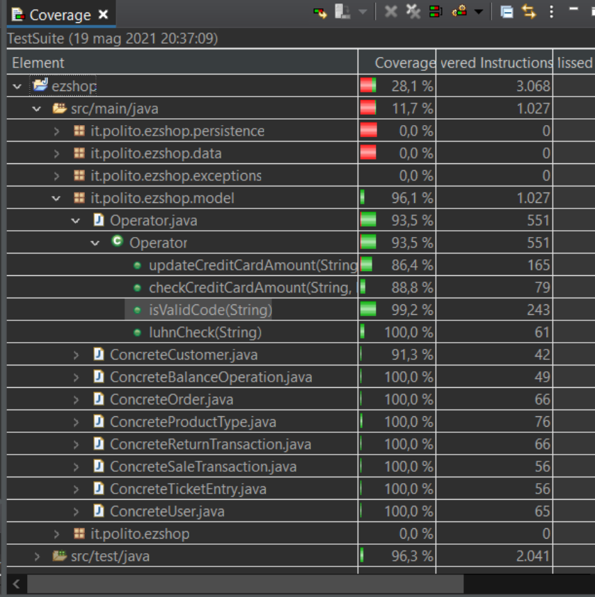

# Unit Testing Documentation

Authors:

Date:

Version:

# Contents

- [Black Box Unit Tests](#black-box-unit-tests)

- [White Box Unit Tests](#white-box-unit-tests)

# Black Box Unit Tests

    <Define here criteria, predicates and the combination of predicates for each function of each class.
    Define test cases to cover all equivalence classes and boundary conditions.
    In the table, report the description of the black box test case and (traceability) the correspondence with the JUnit test case writing the 
    class and method name that contains the test case>
    <JUnit test classes must be in src/test/java/it/polito/ezshop   You find here, and you can use,  class TestEzShops.java that is executed  
    to start tests
    >

#### Note: the unit test for the getter and setter are not reported in the document because they do not have any criteria

 # *Class *Operator**

### Method isValid

**Criteria for method *isValid*:**
	
 - Validity of the string
 - productCode length
 - productCode format  
 - character type of the productCode

**Predicates for method *isValid*:**

| Criteria | Predicate |
| -------- | --------- |
| Validity of the string | valid|
|  | NULL |
| productCode length |(0, 12)|
|  | [12, 14]|
|  | (14 , maxString)|
| productCode format | last value is a digit  -> true|
| | last value is not a digit -> false|
| character type of the productCode | all number |
|  | alphabetic value |
|  | alphanumeric value |

**Boundaries**:

| Criteria | Boundary values |
| -------- | --------------- |
| poductCode length | 0, 12, 14 |

**Combination of predicates**:

|Validity of the string | producCode length | producTCode format |Valid / Invalid | Description of the test case | JUnit test case|
|-------|-------|-------|-------|-------|-------|
| Valid | 12 | true | Valid | T1a(123456789104) -> true | testIsValidLength12() |
| Valid | 13 | true | Valid | T2(4563789345138) -> true | testIsValidLength13()  |
| Valid | 14 | true | Valid | T3(45637485902647) -> true |testIsValidLength14()  |
| Valid | 11 | false | Invalid | T4(12345678910) -> false |testIsValidLength11()  |
| Valid | 15 | false | Invalid | T5(456374859026475) -> false |testIsValidLength15()  |
| Valid | 0 | false | Invalid | T5("") -> false |testIsValidEmptyCode()  |
| InValid | null | null | Invalid | T6(null) -> false |testIsValidNullCode()  |

### Method luhnCheck

**Criteria for method *luhnCheck*:**
	

 - validity of the String
 - Length of the string

**Predicates for method *luhnCheck*:**

| Criteria               | Predicate             |
| ---------------------- | --------------------- |
| validity of the String | Valid                 |
|                        | NULL                  |
| Length of the string   | [0,13)                |
|                        | [13,14)               |
|                        | [14,16)               |
|                        | [16, maxStringLenght) |
**Boundaries**:

| Criteria | Boundary values |
| -------- | --------------- |
| Length of the string| 0, 13, 14, 15|

**Combination of predicates**:

| Validity of the String | Length of the String| Valid / Invalid | Description of the test case | JUnit test case|
|-------|-------|-------|-------|-------|
| Valid | 13 | Valid | T1(4485370086510891) -> true  |testLuhnCheckValidCode1()  |
| Valid | 16  | Valid | T2(4716258050958645) -> true |testLuhnCheckValidCode2()   |
| Invalid | 16 | Invalid | T3a(45637485902647) -> false   T3b(123456789102345) -> false   T3c(1234567812345678) -> false |testLuhnCheckInvalidCode()   |
| Invalid | 0  | Invalid | T4("") -> false | testLuhnCheckEmptyCode()  |
| Invalid | NULL  | Invalid | T5(null) -> false | testLuhnCheckNullCode() |
| Invalid | NULL  | Invalid | T6(as1312sall21idò) -> false | testLuhnCheckAlphanumericCode() |

### Method checkCreditCardAmount

**Criteria for method *checkCreditCardAmount*:**
	
 - Validity of the creditCard String
 - sign of the toPay value
 - truth of the debit value
 - existence of the creditCard

**Predicates for method *checkCreditCardAmount*:**

| Criteria | Predicate |
| -------- | --------- |
| Validity of the string | Valid|
|  | NULL |
|  | "" |
|sign of the toPay value | (mindouble, 0] |
| | (0, maxdouble) |
|truth of the debit value | True |
| | False |
|Existance of the credit card | Yes |
| | No|

**Boundaries**:

| Criteria | Boundary values |
| -------- | --------------- |
| sign of the toPay value| 0, 0.00001  |

**Combination of predicates**:

|Validity of the creditCard String | sign of the toPay value | truth of the debit value | Existence of the credit Card|Valid / Invalid | Description of the test case | JUnit test case|
|-------|-------|-------|-------|-------|-------|-------|
| Valid |(0, maxdouble) | * | true | Valid |t1("4485370086510891", 10.5, true) -> true t1a("4485370086510891", 10.5, false) -> true   t1b("100293991053009", 9.5, true) -> true  t1c("100293991053009", 9.5, false) -> true | testCheckCreditCardAmountWithValidAmount() |
| Valid |(0, maxdouble) | * | false | Valid |t2("4485370086510892", 10.5, true) -> false t2a("4485370086510892", 10.5, false) -> false   t2b("dasdsa21321sad", 2.0, false) -> false | testCheckCreditCardAmountWithInvalidCreditCard() |
| Valid |(0, maxdouble) | true | true | Valid |t3("100293991053009", 155.4, true)-> false | testCheckCreditCardAmountWithNegativeAmount() |
| Valid |(mindouble,0] | * | * | Valid |t4("100293991053009", -10.4, true))-> false   t4a("100293991053009", -10.4, false) -> false | testCheckCreditCardAmountWithAmountTooBig() |
| NULL |* | * | * | Valid |t5(null, 10.5, false) -> false,   t5a(null, 10.5, true) -> false | testCheckCreditCardAmountWithNullCreditCard() |
| "" |* | * | * | Valid |t6("", 10.5, false) -> false t6a("", 10.5, true) -> false | testCheckCreditCardAmountWithEmptyCreditCard() |

### Method updateCreditCardAmount

**Criteria for method *updateCreditCardAmount*:**
	
 - Validity of the creditCard String
 - sign of the toPay value
 - truth of the debit value
 - existence of the creditCard

**Predicates for method *updateCreditCardAmount*:**

| Criteria | Predicate |
| -------- | --------- |
| Validity of the string | Valid|
|  | NULL |
|  | "" |
|sign of the toPay value | (mindouble, 0] |
| | (0, maxdouble) |
|truth of the debit value | True |
| | False |
|Existance of the credit card | Yes |
| | No|

**Boundaries**:

| Criteria | Boundary values |
| -------- | --------------- |
| sign of the toPay value| 0, 0.00001  |

**Combination of predicates**:

|Validity of the creditCard String | sign of the toPay value | truth of the debit value | Existence of the credit Card|Valid / Invalid | Description of the test case | JUnit test case|
|-------|-------|-------|-------|-------|-------|-------|
| Valid |(0, maxdouble) | * | true | Valid |t1("4485370086510891", 10.5, true) -> true t1a("4485370086510891", 10.5, false) -> true   t1b("4716258050958645", 22.5, false) -> true)   t1c("4716258050958645", 22.5, true) -> true) | testUpdateCreditCardAmountWithValidValue() |
| Valid |(0, maxdouble) | * | False | Invalid |t2(null, 10.5, true) -> false t2a(null, 10.5, false) -> false   t2b("", 10.5, false) -> false,   t2c("", 10.5, true) -> false| testUpdateCreditCardAmountWithInvalidCode() |
| Valid |(mindouble, 0 ] | * | false | Valid |t3("4716258050958645", -10.5, true)-> false    t3a("4716258050958645", -10.5, false)-> false,   t3b("4716258050958645", 0, true)-> false,   t3c("4716258050958645", 0, true)-> false| testUpdateCreditCardWithInvalidAmount() |
| Valid |(0, maxdouble] | * | false | Valid |t4("21231321312322", 210.5, true))-> false   t4a("21231321312322", 13210.5, false) -> false,   t4b("adsdsad212121sad", 2110.5, false) -> false| testUpdateCreditCardWithCodeNotFound() |
| Valid |(0, maxdouble] | * | false | Valid |t5("4716258050958645", 110.5, true))-> false   t5a("4716258050958645", 110.5, false) -> false| testUpdateCreditCardWithAmountTooBig() |

# White Box Unit Tests

### Test cases definition

    <JUnit test classes must be in src/test/java/it/polito/ezshop>
    <Report here all the created JUnit test cases, and the units/classes under test >
    <For traceability write the class and method name that contains the test case>

## *Class *Operator**

| Unit name | JUnit test case |
|--|--|
| isValidCode | testIsValidLength12() |
| isValidCode | testIsValidLength13() |
| isValidCode | testIsValidLength14() |
| isValidCode | testIsValidLength11() |
| isValidCode | testIsValidLength15() |
| isValidCode | testIsValidEmptyCode() |
| isValidCode | testIsValidNullCode() |
| luhnCheck | testLuhnCheckValidCode1() |
| luhnCheck | testLuhnCheckValidCode2() |
| luhnCheck | testLuhnCheckInvalidCode() |
| luhnCheck | testLuhnCheckEmptyCode() |
| luhnCheck | testLuhnCheckNullCode() |
| luhnCheck | testLuhnCheckAlphanumericCode() |
| checkCreditCardAmount | testCheckCreditCardAmountWithValidAmount() |
| checkCreditCardAmount | testCheckCreditCardAmountWithInvalidCreditCard() |
| checkCreditCardAmount | testCheckCreditCardAmountWithAmountTooBig() |
| checkCreditCardAmount | testCheckCreditCardAmountWithNegativeAmount() |
| checkCreditCardAmount | testCheckCreditCardAmountWithNullCreditCard() |
| checkCreditCardAmount | testCheckCreditCardAmountWithEmptyCreditCard() |
| updateCreditCardAmount | testUpdateCreditCardAmountWithValidValue() |
| updateCreditCardAmount | testUpdateCreditCardAmountWithInvalidCode() |
| updateCreditCardAmount | testUpdateCreditCardWithAmountTooBig() |
| updateCreditCardAmount | testUpdateCreditCardWithInvalidAmount() |
| updateCreditCardAmount | testUpdateCreditCardWithCodeNotFound() |

### Code coverage report

    <Add here the screenshot report of the statement and branch coverage obtained using
    the Eclemma tool. >
	

### Loop coverage analysis

    <Identify significant loops in the units and reports the test cases
    developed to cover zero, one or multiple iterations >

|Unit name | Loop rows | Number of iterations | JUnit test case |
|---|---|---|---|
| isValidCode | 26 | 11 | testIsValidLength12() |
| isValidCode | 19 | 12 | testIsValidLength13() |
| isValidCode | 26 | 13 | testIsValidLength14() |
| isValidCode | Not to be considered because it does not try to enter loop | 0 (--) | testIsValidLength11() |
| isValidCode | Not to be considered because it does not try to enter loop | 0 (--) | testIsValidLength15() |
| luhnCheck | 56 | 15 | testLuhnCheckValidCode1() |
| luhnCheck | Not to be considered because it does not try to enter loop | 0 (--) | testLuhnCheckEmptyCode() |
| luhnCheck | Not to be considered because it does not try to enter loop | 0 (--) | testLuhnCheckNullCode() |
| checkCreditCardAmount | 100 | 6, 8 | testCheckCreditCardAmountWithValidAmount() |
| checkCreditCardAmount | 100 | 6 | testCheckCreditCardAmountWithInvalidCreditCard() |
| checkCreditCardAmount | Not to be considered because it does not try to enter loop | 0 (--) | testCheckCreditCardAmountWithNullCreditCard() |
| checkCreditCardAmount | Not to be considered because it does not try to enter loop | 0 (--) | testCheckCreditCardAmountWithEmptyCreditCard() |
| updateCreditCardAmount | 162 | 6 | testCheckCreditCardAmountWithValidAmount() |
| updateCreditCardAmount | 162 | 8 | testCheckCreditCardAmountWithValidAmount() |
| updateCreditCardAmount | Not to be considered because it does not try to enter loop | 0 (--) | testUpdateCreditCardAmountWithInvalidCode() |
| updateCreditCardAmount | Not to be considered because it does not try to enter loop | 0(--) | testUpdateCreditCardWithAmountTooBig() |
| updateCreditCardAmount | Not to be considered because it does not try to enter loop | 0 (--) | testUpdateCreditCardWithInvalidAmount() |

#### note: it is not possible to define test cases such that there are 0 and 1 iteration (to reach 3/3 coverage)

#### 